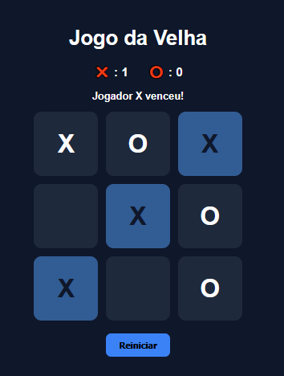

# 🎮 Jogo da Velha com IA (Minimax)

Jogo da velha interativo desenvolvido com HTML, CSS e JavaScript puro, com inteligência artificial baseada no algoritmo Minimax.

## 🚀 Demonstração
🔗 https://github.com/ruancordeirodev/jogo-da-velha

---

## ⚙️ Funcionalidades

- 🎮 Jogador vs IA
- 🧠 IA inteligente (Minimax – impossível de perder)
- 🏆 Detecção de vitória e empate
- 🎨 Destaque da linha vencedora
- 🔄 Reset de partida
- 📱 Interface responsiva
- ⚡ Atualização de estado em tempo real

---

## 🧠 Lógica aplicada

- Algoritmo Minimax para tomada de decisão da IA
- Controle de estado do jogo via array (board state)
- Validação de condições de vitória
- Renderização dinâmica do DOM

---

## 🛠️ Tecnologias

- HTML5
- CSS3
- JavaScript

---

## 📸 Preview

---

## 💡 Aprendizados

- Manipulação avançada do DOM
- Lógica de jogos e árvores de decisão
- Implementação de algoritmo recursivo (Minimax)
- Controle de estado limpo em JavaScript

---

## 📌 Status do Projeto

✔ Finalizado  
✔ Responsivo    

---

## 👨‍💻 Autor

Desenvolvido por [RUAN CORDEIRO DOS SANTOS ]